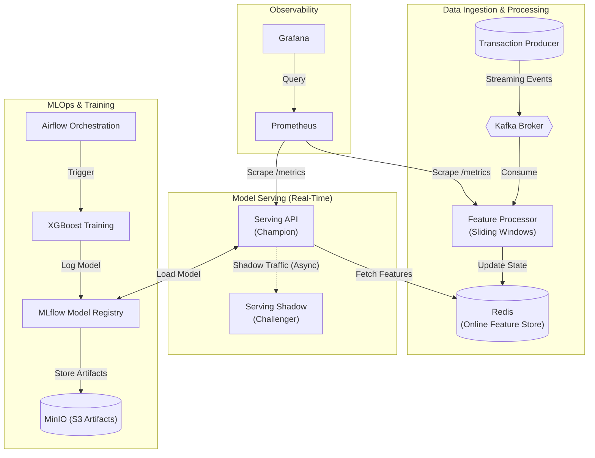

# Real-Time Credit Card Fraud Detection System

<div align="center">


**An end-to-end production MLOps system for real-time transaction monitoring and fraud detection.**

</div>

---

## Project Overview

This repository implements a production-grade **Real-Time Fraud Detection Engine** capable of processing streaming transaction data, computing near real-time features, and serving high-concurrency model predictions with sub-10ms latency. The system demonstrates a complete MLOps lifecycle, including feature stores, automated retraining, shadow deployments, and drift monitoring.

### Key Capabilities

*   **Streaming Feature Engineering**: Real-time sliding window aggregations via Apache Kafka and Redis.
*   **Shadow Deployment**: Automatic fire-and-forget traffic shadowing to evaluate challenger models on live production traffic.
*   **Automated MLOps Pipeline**: End-to-end retraining orchestrated by Apache Airflow, triggered by automated drift detection (Evidently AI).
*   **Enterprise Observability**: Integrated Prometheus and Grafana dashboards for monitoring business metrics, model performance, and system health.
*   **Production Deployment**: Fully containerized architecture with support for both Docker Compose and Kubernetes (Helm).
*   **Scalable Architecture**: Horizontal Pod Autoscaling (HPA) configured for high-throughput (1000+ TPS) workloads.

---

## Architecture

The system is organized into three decoupled pipelines: **Data Processing**, **Real-Time Serving**, and **MLOps Automation**.



### Data Flow

1.  **Ingestion**: A synthetic producer generates realistic transaction streams (10 TPS) with injected fraud patterns.
2.  **Processing**: The Feature Processor maintains in-memory sliding window state for every user, computing behavioral features and persisting them to a low-latency Redis hash.
3.  **Inference**: The FastAPI serving layer recovers features from Redis and combines them with request data for sub-10ms XGBoost inference.
4.  **Shadowing**: Every production request is asynchronously mirrored to a challenger (shadow) model for performance comparison without affecting user latency.
5.  **Monitoring**: Prometheus pulls operational metrics while Evidently AI monitors data drift, feeding into the automated Airflow retraining loop.

---

## Tech Stack

| Component | Technology | Role |
| :--- | :--- | :--- |
| **Messaging** | Apache Kafka | Streaming backbone and backpressure management |
| **Feature Store** | Redis | High-speed online feature retrieval |
| **ML Engine** | XGBoost | High-performance gradient boosted decision trees |
| **API Layer** | FastAPI | High-concurrency RESTful model serving |
| **Orchestration** | Apache Airflow | Scheduled retraining and drift monitoring workflows |
| **Tracking** | MLflow | Experiment tracking and central model registry |
| **Artifacts** | MinIO (S3) | Persistent storage for model binaries and parquet data |
| **Observability** | Prometheus / Grafana | System health and business performance dashboards |
| **Scaling** | Kubernetes HPA | CPU-based auto-scaling (1-8 replicas) |

---

## Getting Started

### Prerequisites

*   **Docker Desktop** (Required: 4GB+ RAM)
*   **Python 3.11+** (Optional: for local experimentation)
*   **Kind & Helm** (Required: for Kubernetes deployments)

### Quick Start (Docker Mode)

For local development and testing, use the standardized lifecycle scripts:

```bash
./scripts/docker-up.sh              # Start all services
./scripts/docker-up.sh --clean       # Fresh start with volume cleanup
./scripts/docker-down.sh             # Stop all services
```

### Advanced Start (Kubernetes Mode)

To simulate a production environment with auto-scaling and high availability:

```bash
./scripts/k8s-up-fresh.sh            # Create Kind cluster and install Helm charts
./scripts/k8s-up-fast.sh             # Resume existing cluster with latest config
./scripts/k8s-autoscale-demo.sh      # Run autoscaling demo (1000 TPS load)
./scripts/k8s-down.sh                # Uninstall stack and cleanup cluster
```

### Accessing the Stack

| Service | URL | Note |
| :--- | :--- | :--- |
| **Fraud API** | `http://localhost:8000/docs` | Interactive Swagger documentation |
| **Grafana** | `http://localhost:3000` | admin / admin |
| **MLflow** | `http://localhost:5000` | Experiment & Model Tracking |
| **Airflow** | `http://localhost:8080` | admin / admin |
| **MinIO** | `http://localhost:9001` | S3-compatible console |

---

## Feature Engineering

The system computes near-real-time behavioral features to detect sophisticated fraud patterns:

*   **Velocity Features**: Tracking transaction counts in sliding windows (10m, 1h, 24h) to detect card testing.
*   **Aggregated Spending**: `total_amount_10m`, `avg_amount_24h` to identify unusual spending bursts.
*   **Location Diversity**: `distinct_cities_1h` to flag "impossible travel" scenarios.
*   **Behavioral Context**: `amount_zscore` (deviation from user average), `is_high_risk_merchant`, and time-based features (`hour_of_day`, `is_weekend`).

---

## MLOps & Monitoring

### Automated Retraining
Scheduled daily (or triggered by drift), the Airflow pipeline:
1.  **Drift Check**: Executes Evidently AI drift reports on the last 24 hours of traffic.
2.  **Dataset Generation**: Pulls historical features from MinIO/Parquet storage.
3.  **Model Training**: XGBoost training with hardware acceleration (GPU auto-detect).
4.  **Validation**: Gates promotion based on minimum Precision (90%) and Recall (50%) thresholds.
5.  **Promotion**: Updates the MLflow Model Registry and triggers a seamless service deployment.

### System Observability
Custom Prometheus exporters track real-time performance:
*   `fraud_predictions_total`: Real-time fraud vs. legitimate counts.
*   `inference_latency_seconds`: P95/P99 latency distribution.
*   `shadow_agreement_percent`: Consistency between champion and shadow models.

---

## Project Structure

```text
|-- .github/workflows/    # CI/CD (Linting, Tests, Container Build)
|-- airflow/              # MLOps DAGs and Dockerized Airflow config
|-- features/             # Feature Processor (Consumer + Window Logic)
|-- helm/                 # Production-grade Kubernetes manifests
|-- k8s/                  # Raw K8s manifests for simple deployment
|-- monitoring/           # Prometheus/Grafana configs + Drift logic
|-- producer/             # Transaction generator (Streaming simulator)
|-- scripts/              # Standardized lifecycle management scripts
|-- serving/              # FastAPI model serving entrypoint
|-- training/             # XGBoost trainers and dataset generators
\-- docker-compose.yaml   # Local orchestration
```

---

## License

MIT License. See [LICENSE](LICENSE) for more information.

